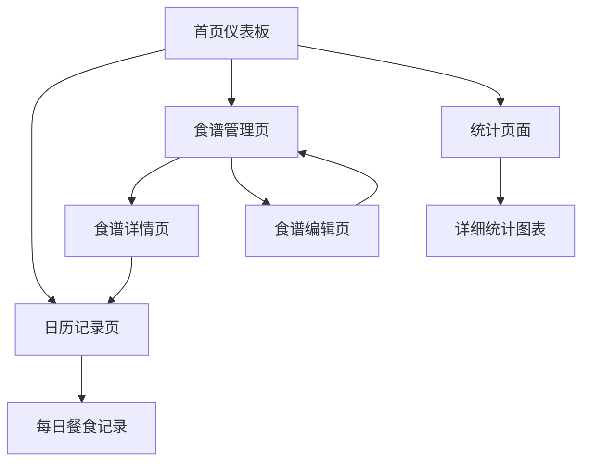

## 1. 产品概述

这是一个专为macOS设计的本地食谱记录应用，帮助用户记录每日烹饪的饭菜。用户可以创建、管理和浏览自己的食谱库，记录每日用餐情况，并通过统计功能了解自己的烹饪习惯。

该应用主要解决以下问题：帮助用户系统化记录个人烹饪经历，建立个人食谱数据库，追踪饮食习惯，提升烹饪技能。

## 2. 核心功能

### 2.1 用户角色

| 角色 | 注册方式 | 核心权限 |
|------|----------|----------|
| 个人用户 | 本地账户创建 | 完整使用所有功能，数据本地存储 |

### 2.2 功能模块

我们的食谱记录应用包含以下主要页面：

1. **首页仪表板**：今日用餐概览、快速添加、最近食谱、统计数据预览
2. **食谱管理页**：食谱列表、搜索筛选、食谱详情、编辑创建
3. **日历记录页**：月历视图、每日用餐记录、快速添加餐食
4. **统计页面**：烹饪频率分析、菜系统计、用餐时间分布
5. **搜索页面**：全文搜索、标签筛选、高级搜索选项
6. **设置页面**：应用设置、数据管理、备份恢复

### 2.3 页面详情

| 页面名称 | 模块名称 | 功能描述 |
|----------|----------|----------|
| 首页仪表板 | 今日概览 | 显示今日已记录的餐食、推荐食谱、快速添加按钮 |
| 首页仪表板 | 最近食谱 | 展示最近查看或创建的5个食谱卡片 |
| 首页仪表板 | 统计预览 | 显示本周烹饪次数、最受欢迎菜系等关键数据 |
| 食谱管理页 | 食谱列表 | 以卡片形式展示所有食谱，支持排序和筛选 |
| 食谱管理页 | 搜索筛选 | 按菜名、食材、标签、菜系进行搜索 |
| 食谱管理页 | 食谱详情 | 显示完整食谱信息：食材、步骤、图片、营养信息 |
| 食谱管理页 | 食谱编辑 | 创建新食谱、编辑现有食谱、上传图片、添加标签 |
| 日历记录页 | 月历视图 | 月历形式展示每日用餐记录，支持点击查看详情 |
| 日历记录页 | 餐食记录 | 添加/编辑某日的早餐、午餐、晚餐、加餐 |
| 日历记录页 | 快速添加 | 从已有食谱快速添加到指定日期 |
| 统计页面 | 烹饪分析 | 按时间维度统计烹饪频率、菜系分布 |
| 统计页面 | 用餐习惯 | 分析用餐时间规律、季节性偏好 |
| 搜索页面 | 全文搜索 | 搜索食谱名称、食材、制作步骤中的关键词 |
| 搜索页面 | 高级筛选 | 按烹饪时间、难度、菜系、标签组合筛选 |
| 设置页面 | 应用设置 | 主题设置、提醒设置、单位偏好 |
| 设置页面 | 数据管理 | 数据导出、导入、备份、恢复功能 |

## 3. 核心流程

主要用户操作流程：

1. **日常记录流程**：打开应用 → 查看今日概览 → 点击添加餐食 → 选择已有食谱或新建 → 保存到日历
2. **食谱管理流程**：进入食谱页面 → 浏览/搜索食谱 → 查看详情 → 编辑或收藏 → 返回列表
3. **数据查看流程**：查看统计页面 → 选择时间范围 → 查看图表分析 → 导出报告

## 4. 用户界面设计

### 4.1 设计风格

- **主色调**：温暖的橙色(#FF6B35)搭配白色背景，营造温馨的烹饪氛围
- **辅助色**：深灰色(#2C3E50)用于文字，浅灰色(#ECF0F1)用于背景区分
- **按钮样式**：圆角矩形设计，主要按钮使用主色调，次要按钮使用边框样式
- **字体选择**：系统默认字体，标题16px，正文14px，小字12px
- **布局风格**：卡片式布局，顶部导航栏，侧边栏快捷操作
- **图标风格**：使用SF Symbols，保持与macOS系统风格一致

### 4.2 页面设计概述

| 页面名称 | 模块名称 | UI元素 |
|----------|----------|--------|
| 首页仪表板 | 今日概览 | 大卡片展示，包含圆形进度条显示今日完成度，快速添加按钮置于右下角 |
| 首页仪表板 | 最近食谱 | 横向滚动的食谱卡片，每张卡片包含图片、菜名、制作时间 |
| 食谱管理页 | 食谱列表 | 网格布局的卡片，每行3-4个，卡片包含图片、菜名、标签、收藏按钮 |
| 食谱管理页 | 搜索栏 | 顶部搜索框，支持实时搜索，右侧有筛选按钮 |
| 日历记录页 | 月历视图 | 传统月历布局，每个日期格子显示餐食图标，点击展开详情 |
| 统计页面 | 图表区域 | 使用柱状图和饼图展示数据，支持切换时间范围 |

### 4.3 响应式设计

采用桌面优先设计，针对macOS特性进行优化：
- 支持深色模式自动切换
- 适配不同屏幕尺寸的Mac设备
- 支持触控板手势操作
- 优化键盘快捷键支持

## 5. 技术特性

- **本地数据存储**：使用IndexedDB确保数据本地保存
- **离线使用**：完全支持离线操作，联网时可选同步
- **图片管理**：本地图片压缩和存储，支持拖拽上传
- **数据导出**：支持PDF、Excel格式的数据导出
- **搜索优化**：全文搜索索引，快速响应查询