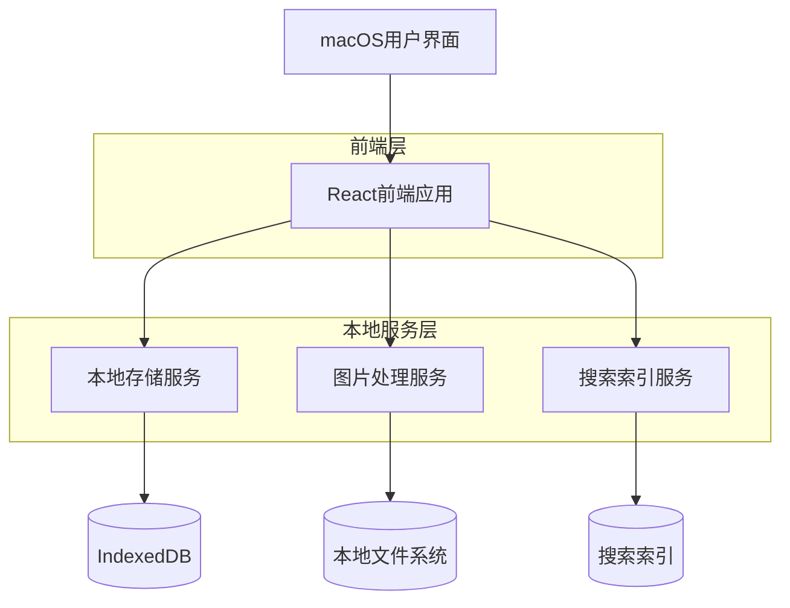
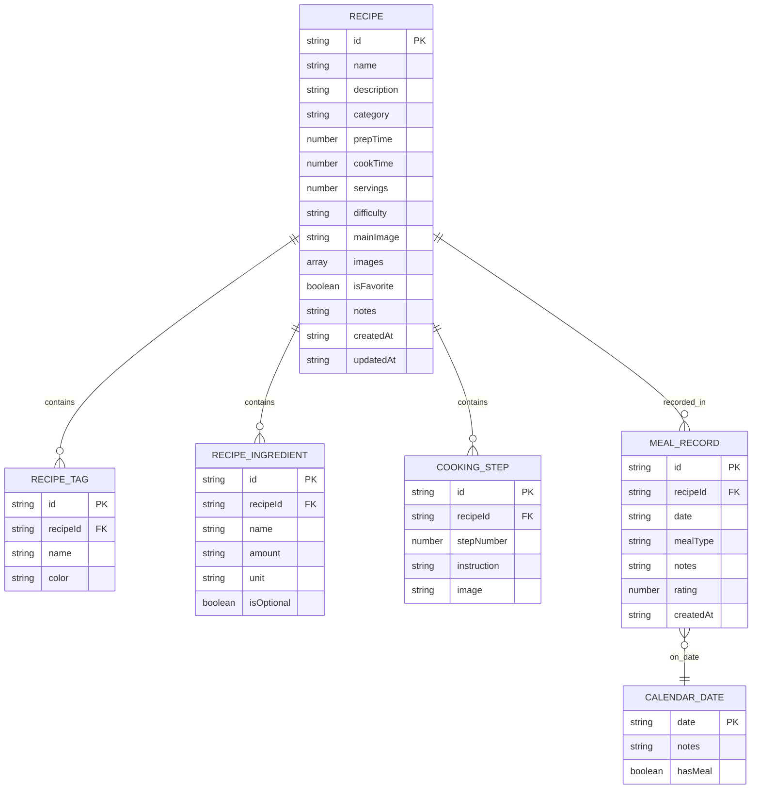

## 1. 架构设计



## 2. 技术描述

- **前端框架**：React@18 + TypeScript@5
- **初始化工具**：vite-init
- **UI框架**：Tailwind CSS@3 + Headless UI
- **状态管理**：Zustand@4
- **本地存储**：IndexedDB via dexie@3
- **图片处理**：Compressor.js + File API
- **搜索功能**：Fuse.js模糊搜索
- **图表库**：Chart.js@4
- **日期处理**：date-fns
- **图标**：lucide-react
- **后端**：无（纯前端应用）

## 3. 路由定义

| 路由 | 用途 |
|------|------|
| / | 首页仪表板，显示今日概览和快速操作 |
| /recipes | 食谱列表页面，展示所有食谱 |
| /recipes/new | 新建食谱页面，创建新食谱 |
| /recipes/:id | 食谱详情页面，查看具体食谱信息 |
| /recipes/:id/edit | 编辑食谱页面，修改现有食谱 |
| /calendar | 日历页面，查看和记录每日餐食 |
| /calendar/:date | 指定日期的餐食记录页面 |
| /statistics | 统计页面，展示烹饪数据分析 |
| /search | 搜索页面，高级搜索和筛选 |
| /settings | 设置页面，应用配置和数据管理 |

## 4. 数据模型

### 4.1 数据模型定义



### 4.2 数据定义语言

**食谱表 (recipes)**
```javascript
// IndexedDB schema using Dexie
db.version(1).stores({
  recipes: `
    id, 
    name, 
    category, 
    prepTime, 
    cookTime, 
    difficulty, 
    isFavorite, 
    createdAt, 
    updatedAt
  `,
  
  recipeTags: `
    id, 
    recipeId, 
    name, 
    color
  `,
  
  recipeIngredients: `
    id, 
    recipeId, 
    name, 
    amount, 
    unit, 
    isOptional
  `,
  
  cookingSteps: `
    id, 
    recipeId, 
    stepNumber, 
    instruction
  `,
  
  mealRecords: `
    id, 
    recipeId, 
    date, 
    mealType, 
    rating, 
    createdAt
  `,
  
  settings: `
    key, 
    value
  `
});
```

**TypeScript接口定义**
```typescript
interface Recipe {
  id: string;
  name: string;
  description?: string;
  category: string;
  prepTime: number; // 分钟
  cookTime: number; // 分钟
  servings: number;
  difficulty: 'easy' | 'medium' | 'hard';
  mainImage?: string;
  images: string[];
  isFavorite: boolean;
  notes?: string;
  createdAt: string;
  updatedAt: string;
}

interface RecipeIngredient {
  id: string;
  recipeId: string;
  name: string;
  amount: string;
  unit: string;
  isOptional: boolean;
}

interface CookingStep {
  id: string;
  recipeId: string;
  stepNumber: number;
  instruction: string;
  image?: string;
}

interface MealRecord {
  id: string;
  recipeId: string;
  date: string; // YYYY-MM-DD
  mealType: 'breakfast' | 'lunch' | 'dinner' | 'snack';
  notes?: string;
  rating?: number; // 1-5
  createdAt: string;
}

interface RecipeTag {
  id: string;
  recipeId: string;
  name: string;
  color: string;
}
```

## 5. 核心服务设计

### 5.1 本地存储服务
- 使用Dexie封装IndexedDB操作
- 提供数据增删改查的统一接口
- 实现数据的版本管理和迁移
- 支持数据的导入导出功能

### 5.2 图片处理服务
- 使用Compressor.js进行图片压缩
- 实现图片的本地存储和缓存
- 支持多张图片的管理和预览
- 提供图片的懒加载功能

### 5.3 搜索服务
- 使用Fuse.js实现模糊搜索
- 建立多字段索引（菜名、食材、标签）
- 支持搜索结果的排序和过滤
- 实现搜索历史记录功能

### 5.4 统计服务
- 基于mealRecords数据生成统计图表
- 支持多维度分析：时间、菜系、难度等
- 提供数据的可视化展示
- 支持统计数据的导出功能

## 6. 性能优化

### 6.1 数据加载优化
- 实现分页加载，避免一次性加载大量数据
- 使用虚拟滚动优化长列表性能
- 图片懒加载和预加载策略
- 数据的本地缓存机制

### 6.2 内存管理
- 及时清理不需要的数据引用
- 使用WeakMap管理临时数据
- 实现组件的懒加载
- 优化大型数据对象的处理

## 7. 安全与备份

### 7.1 数据安全
- 所有数据本地存储，不上传服务器
- 敏感信息加密存储
- 提供数据导出备份功能
- 支持数据的定期自动备份

### 7.2 错误处理
- 完善的错误捕获和处理机制
- 数据操作的回滚机制
- 用户操作的确认提示
- 异常情况的数据恢复方案